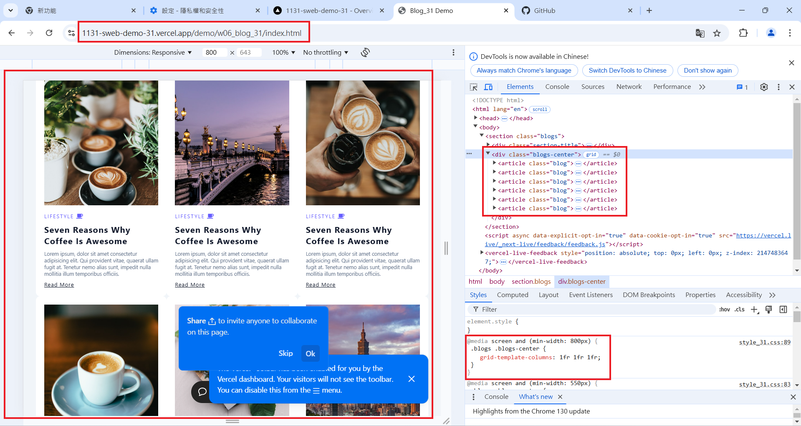
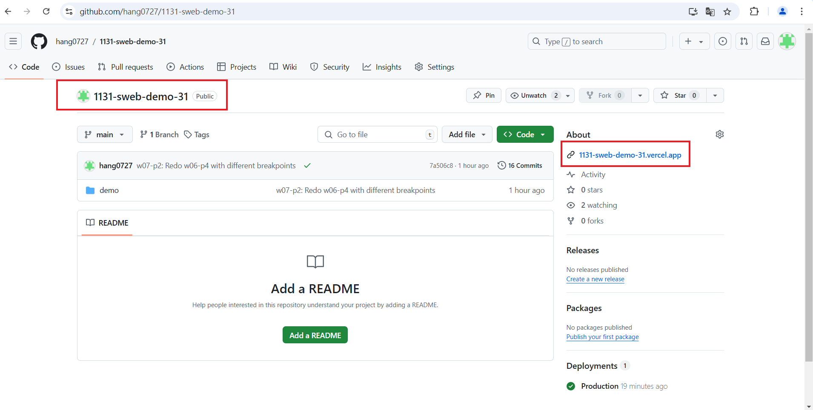
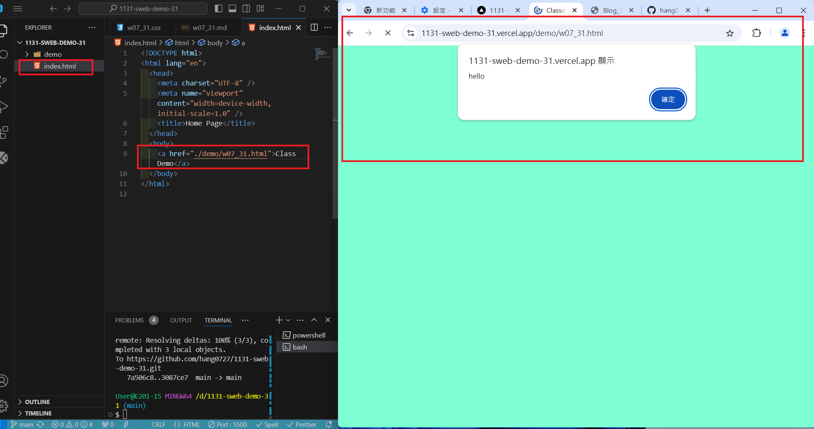

[My Github URL](https://github.com/hang0727/1131-sweb-demo-31.git)

[My Vercel URL](https://1131-sweb-demo-31.vercel.app/)

### w07-p1: Test css and js for w07_31.html


```
932261d hang0727        Thu Oct 24 18:52:30 2024 +0800  w07-p1: Test css and js for w07_31.html
```

### w07-p2: Redo w06-p4 with different breakpoints


```
7a506c8 hang0727        Thu Oct 24 19:20:11 2024 +0800  w07-p2: Redo w06-p4 with different breakpoints
```

### w07-p3: Connect your Github repo to Vercel and have a root home page to class demo navigation

#### => In Vercel, show w06 blogs demo



#### => Show your Github repo with Vercel URL

[My Vercel URL](https://1131-sweb-demo-31.vercel.app/)



#### => create index.html as root home page and have a link to class demo navigation as done in w07



```

```
