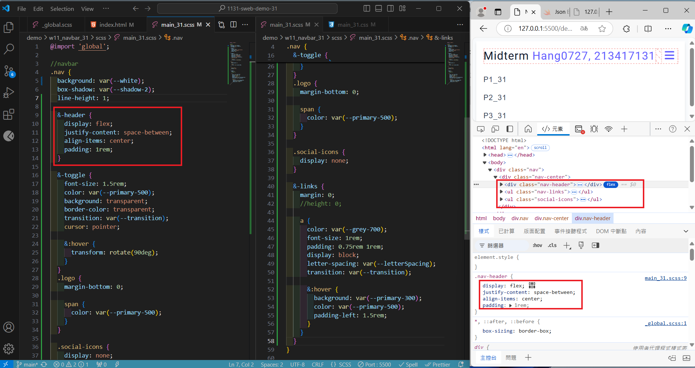

[My Github URL](https://github.com/hang0727/1131-sweb-demo-31.git)

[My Vercel URL](https://1131-sweb-demo-31.vercel.app/)

### w11-p1: Create html code for navbar


```
6765c5f hang0727        Thu Nov 21 19:23:29 2024 +0800  w11-p1: Create html code for navbar
```

### w11-p2: Use scss to convert scss/main_31.css to css/main_31.css


```
16e755a hang0727        Thu Nov 21 20:21:53 2024 +0800  w11-p2: Use scss to convert scss/main_31.css to css/main_31.css
```

### w11-p3: scss for small screen



```

```

### w11-p4: css for larger screen


```
999fa05 hang0727        Fri Nov 22 16:49:35 2024 +0800  w11-p4: css for larger screen
```

### w11-p5:git logs for w11

