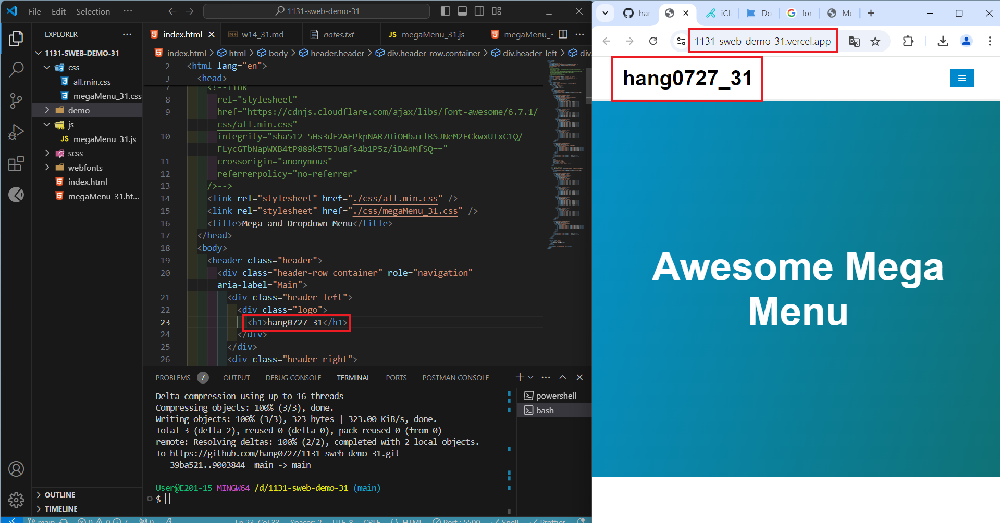

[My Github URL](https://github.com/hang0727/1131-sweb-demo-31.git)

[My Vercel URL](https://1131-sweb-demo-31.vercel.app/)

### w14-p1: Setup mega menu to replace index.html in the home directory

#### => Show in local


#### => Show in Vercel



```
39ba521 hang0727        Thu Dec 12 19:34:57 2024 +0800  w14-p1: Setup mega menu to replace index.html in the home directory
```

### w14-p2: Show class demo of w2, w3, w6 in both local and Vercel

#### => Show in local for w2


#### => Show in local for w3


#### => Show in local for w6


```

```

### w14-p3: Add tictactoe multipage

#### => Show in local 


#### => Show in Vercel


```
b23940e hang0727        Mon Dec 16 17:02:32 2024 +0800  w14-p3: Add tictactoe multipage
```

### w14-p4: git logs for w14


