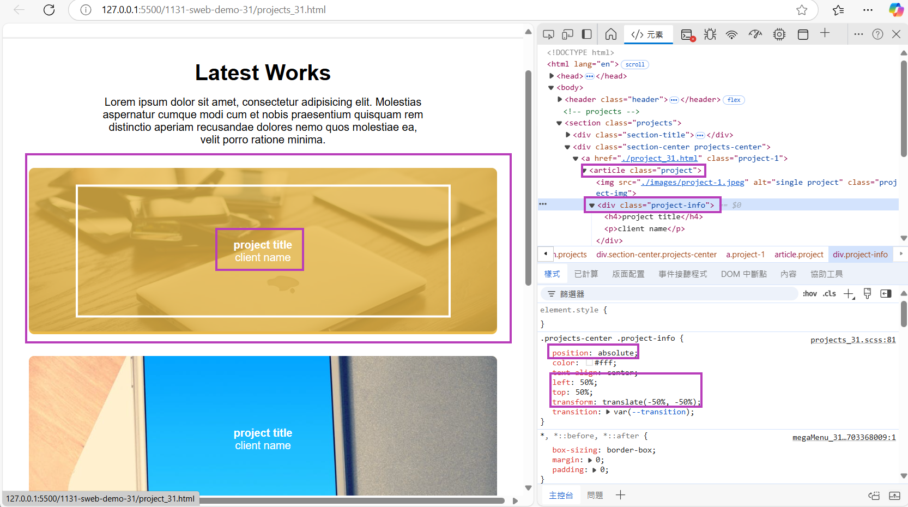
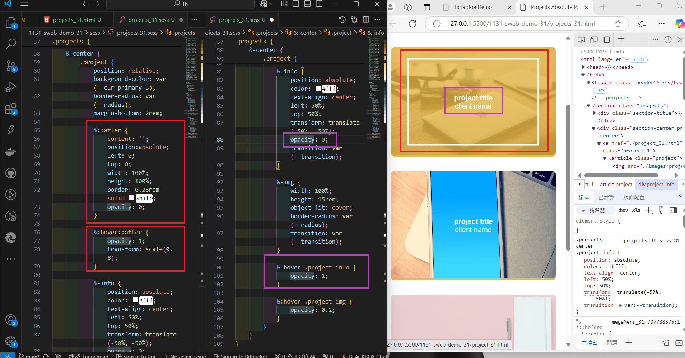

[My Github URL](https://github.com/hang0727/1131-sweb-demo-31.git)

[My Vercel URL](https://1131-sweb-demo-31.vercel.app/)

### w15-p1: Setup div_31.html, div_31.scss, div_tku60_31.js


```
1f7ce07 hang0727        Thu Dec 19 19:52:22 2024 +0800  w15-p1: Setup div_31.html, div_31.scss, div_tku60_31.js
```

### w15-p2: Show div_31.html correctly

#### => select tku60 pic 3, and show relevant youtube video


#### => html, and js code for showing video 3


```

```

### w15-p3: make P2 div_31.html responsive


```

```

### w15-p4: show absolute positioning in project_31.html





```

```

### w15-p5: git logs for w15


